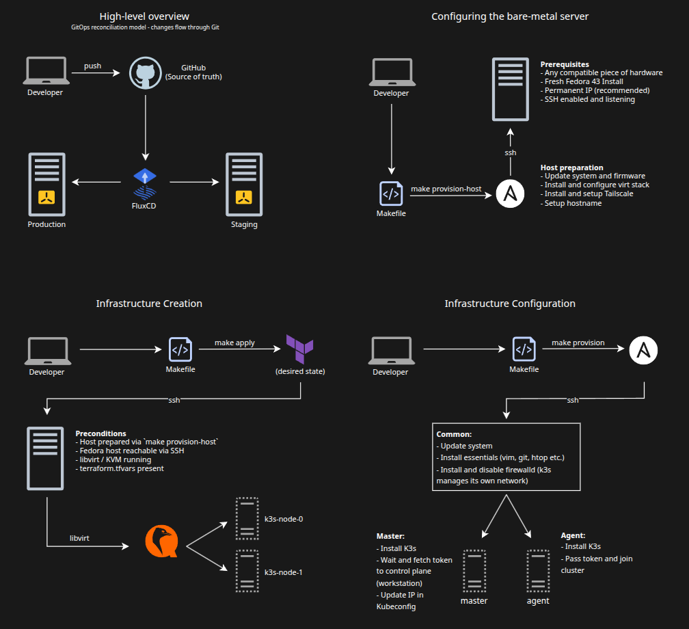

# Homelab

K3s cluster running self-hosted services with a focus on **Total Reproducibility** and **Environment Isolation**.

> [!NOTE] 
> You can find detailed write-ups on my blog:  
> [K3s initial setup](https://gogov.dev/blog/homelab-initial-setup)  
> [Adding Observability with Prometheus & Grafana](https://gogov.dev/blog/homelab-observability)  
> [GitOps, FluxCD Edition](https://gogov.dev/blog/homelab-gitops-fluxcd)  
> [Moving toward virtualization and other design decisions](https://gogov.dev/blog/design-decisions)  
> [Manual to Makefile - Terraform, KVM, Ansible](https://gogov.dev/blog/homelab-terraform-libvirt)  
> [The Complete Pipeline - End-to-end IaC GitOps](https://gogov.dev/blog/end-to-end-iac-gitops)  
> [Implementing SOPS - GitOps secrets management](https://gogov.dev/blog/sops-secret-management)  

## Quick Start 🚀

To reproduce this entire environment on a fresh Fedora host:

### Prerequisites:
1. **Prepare Fedora 43 Host:** Ensure SSH is active and your key is added. Ensure virtualization is enabled at BIOS level.
2. **GitHub PAT**: Provide your GitHub PAT in: provisioning/ansible/roles/flux/tasks/main.yaml 
(preferably via Ansible Vault secret as currently implemented)
3. **Terraform Variables**: Provide the following file in provisioning/terraform/terraform.tfvars:
```sh
# Secrets
server_password = "YOUR_VM_PASSWORD"
ssh_keys = [
  "YOUR_SSH_KEY" 
]
# Variables
node_count    = 2
vm_memory     = "2048"
vm_vcpu       = 2
user_name     = "server"
hostname_base = "k3s-node"
```
4. **Execute Pipeline:**
```bash
cd scripts/
source ./setup_env.sh  # Sets up your shell environment
make provision-host    # Configures KVM/libvirt & Tailscale
make apply             # Provisions VMs via Terraform
make provision         # Bootstraps K3s & FluxCD
```

## Architecture



## Repo Structure
```
.
├── clusters/                # GitOps via FluxCD
│   ├── production/
│   └── staging/
├── infrastructure/          # Cluster-wide setup
│   ├── base/                # Base Configuraiton
│       ├── namespaces/
│       └── networking/
│   ├── production/          # Production specific overlays
│   └── staging/             # Staging specific overlays
├── monitoring/              # Monitoring stack
│   ├── base/
│      ├── grafana/
│      ├── prometheus/
│      ├── kube-state-metrics/
│      ├── node-exporter/
│      └── alertmanager/
│   ├── production/
│   └── staging/             # Staging specific overlays
├── provisioning/            # IaC and Configuration
│   ├── terraform/          
│   └── ansible/        
├── resources/               # README resources
├── scripts/                 # Makefile and environment setup
├── services/                # Services
│   ├── base/
│       ├── homepage/
│       └── jellyfin/
│   ├── production/
│   └── staging/
    
```

## Tooling overview

### Hardware
| Logo | Device | Role |
|:-:|-----|-------------|
|  | Lenovo Thinkpad T14 Gen 1 | Production |
|  | Lenovo Thinkpad X1 Yoga | Staging |
|  | Lenovo Legion 5 Slim | Workstation |

### Infrastructure
| Logo | Name | Description |
|:-:|-----|-------------|
|  | Fedora 43 | Linux Distribution used on Host, VMs and Workstation |
|  | QEMU/KVM | Hypervisor for running virtual machines |
|  | K3s | Lightweight Kubernetes engine |
|  | FluxCD | GitOps tool for managing Kubernetes declaratively |
|  | Terraform | IaC tool for provisioning infrastructure declaratively |
|  | Ansible | Automation tool for post-provisioning configuration and orchestration |
|  | SOPS | Secret OPerationS - tool for managing secrets |
|  | Cilium | Solution for providing, securing, and observing network connectivity |
|  | NGINX | Used as reverse proxy at the host level |

### Monitoring
| Logo | Name | Description |
|:-:|-----|-------------|
|  | Prometheus | Scrapes infrastructure metrics for visualization in Grafana |
|  | AlertManager | Sends notifications and alerts based on Prometheus metrics |
|  | Grafana | Dashboard and visualization for metrics collected by Prometheus |
|  | kube-state-metrics | Exposes Kubernetes cluster-level metrics for Prometheus |
|  | node-exporter | Collects host-level metrics for Prometheus |
|  | k9s | CLI tool to interactively view Kubernetes resources |

### Services
| Logo | Name | Description |
|:-:|-----|-------------|
|  | Jellyfin | Media streaming service | 
|  | Homepage | Highly customizable dashboard |

## Up next / To do list
- Optimizations and reproducibility enhancement
- Networking fine-tuning
- Setup and Makefile refinement
- Implement Kyverno

## Goal

Learn **Kubernetes** by breaking things in a controlled environment. Some services are pretty useful too!